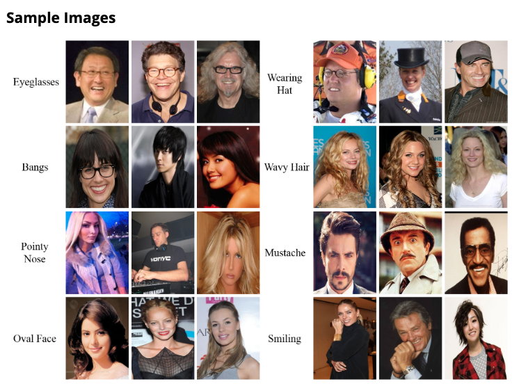
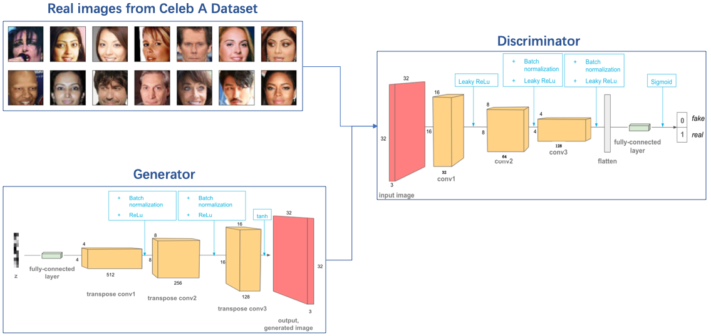
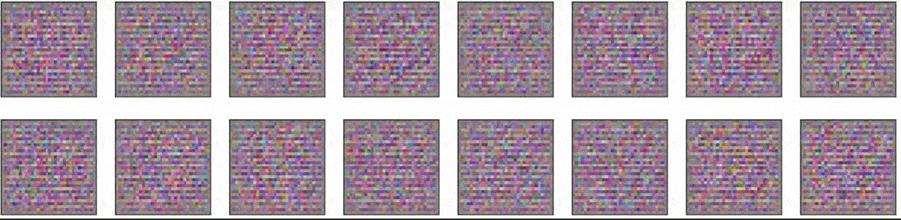

# Deeplearning-Face-Generation
The project is about [Generative Adversarial Networks(GANs) paper](https://arxiv.org/abs/1406.2661) to generate new images of faces. I utitlized the [CelebFaces Attributes Dataset(CelebA)](http://mmlab.ie.cuhk.edu.hk/projects/CelebA.html) to train the model. CelebA is a large-scale face attributes dataset with more than 200K celebrity images, each with 40 attribute annotations. The images in this dataset cover large pose variations and background clutter. 

## DCGANs 

### architecture

## Generator samples from training
View samples of images from the generator.Gradually,the Generator learned to create new images.

## More resources
- [Udacity Deeplearning ND](https://www.udacity.com)
- [DCGAN Tutorial from PyTorch](https://pytorch.org/tutorials/beginner/dcgan_faces_tutorial.html)
- [Generative Models - openai blog](https://openai.com/blog/generative-models/#contributions)
- [How to Train a GAN? Tips and tricks to make GANs work？- Soumith Chintala，Emily Denton，Martin Arjovsky，Michael Mathieu](https://github.com/tomgtqq/ganhacks)
- [Generative Adversarial Nets](https://arxiv.org/pdf/1406.2661.pdf)
- [Batch Normalization](https://arxiv.org/pdf/1502.03167.pdf)
- [Improved Technigques for Training GANs](https://arxiv.org/pdf/1606.03498.pdf)
- [Image-to-Image Translation with Conditional Adversarial Networks](https://arxiv.org/pdf/1611.07004v1.pdf)
- [StackGAN](https://github.com/hanzhanggit/StackGAN)
- [CycleGAN and pix2pix](https://github.com/junyanz/pytorch-CycleGAN-and-pix2pix)
- [Generative models](https://github.com/wiseodd/generative-models)

## Prerequisites

* conda    4.7.12
* pytorch  1.3.0                
* python   3.7.5

## Versioning

We use [SemVer](http://semver.org/) for versioning. For the versions available, see the [tags on this repository](https://github.com/your/project/tags).

## Built With

* [Pytorch](https://pytorch.org/) - An open source machine learning framework that accelerates the path from research prototyping to production deployment.

## Authors

* **Tom** - *Fullstack egineer* - [github profile](https://github.com/tomgtqq)

## License

This project is licensed under the MIT License
